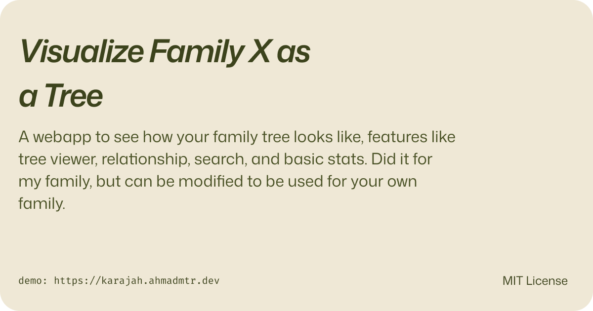

# Family Tree Viewer




A bilingual (Arabic/English) family tree web app built with TanStack Start, React Flow, and Tailwind CSS.

Features: interactive tree visualization (tidy, columns, radial layouts), person profiles, generation filtering, search, relationship finder, and basic statistics.


> [!NOTE]
> This was built for my family and has plenty of hardcoded values. You can make it work for your usecase, but expect some manual work.

## Stack

- Tanstack Start with react
- React Flow (`@xyflow/react`) for the tree canvas
- Tailwind CSS + shadcn/ui
- Zustand
- Bun (scripts)

## Adapting it for your family

### 1. Replace the family data

Edit [src/lib/data.ts](src/lib/data.ts). Each person entry looks like:

```ts
{
  id: "g2-3",           // generation-index, e.g. gen 2, third person
  gen: 2,
  fatherId: "g1-1",     // null for the root ancestor
  nameEn: "Mahmoud Atallah",
  nameAr: "محمود عطالله",
  firstEn: "Ahmad",
  firstAr: "محمود",
  placeEn: "",
  placeAr: "",
  honorific: "رحمه الله",  // shown for deceased for example
  bioEn: "",
  bioAr: "",
  sourcesEn: [],
  verified: true,
}
```

The tree is purely paternal (one `fatherId` per person). `gen` is the generation depth starting from 0 at the root ancestor.

### 2. Update app identity and config

Edit [src/lib/config.ts](src/lib/config.ts):

```ts
export const APP_TITLE  = { en: "X Family Tree", ar: "شجرة عائلة س" }
export const ABOUT_TEXT = { en: "...", ar: "..." }
export const DEFAULT_LANG = 'ar'  // or 'en'
```

### 3. Patronymic names (optional)

If your family uses patronymic naming (e.g. *Ahmad Nasser* → store first name only, display with father's), the script at [scripts/patronymic.ts](scripts/patronymic.ts) can bulk-add or strip the father's first name across all entries:

```bash
bun scripts/patronymic.ts --add      # Ahmad → Ahmad Nasser
bun scripts/patronymic.ts --remove   # Ahmad Nasser → Ahmad
bun scripts/patronymic.ts --dry-run --add
```

## Running locally

```bash
bun install
bun dev        # http://localhost:3000
```

## Deploying

The project includes a `netlify.toml`. Push to a Netlify-connected repo and it should just work. For other hosts, run `bun build` and serve the `dist/` output.
